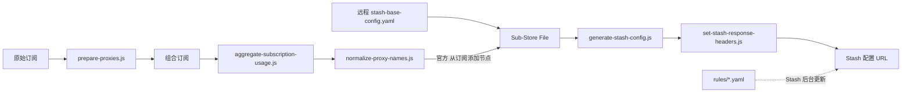

# Sub-Store → Stash Configuration Pipeline

本仓库维护一套可公开托管的 Sub-Store 脚本与 Stash 基础配置。真实订阅地址、Token、UUID、密码、节点内容和最终私有配置不进入仓库。

当前设计把职责拆成三层：

1. Sub-Store 组合订阅负责整理节点名称和聚合流量。
2. Sub-Store File 使用官方“从订阅添加节点”操作，把组合订阅节点加入远程基础配置。
3. Stash 通过 `rule-providers` 独立更新规则，不需要为了修改规则重新生成节点。



## 目录结构

```text
.
├── subscriptions/
│   └── prepare-proxies.js
├── collections/
│   ├── aggregate-subscription-usage.js
│   └── normalize-proxy-names.js
├── files/
│   ├── example.yaml
│   ├── generate-stash-config.js
│   ├── set-stash-response-headers.js
│   └── stash-base-config.yaml
├── rules/
│   ├── ai.yaml
│   ├── developer.yaml
│   ├── developer-download.yaml
│   ├── research.yaml
│   ├── proxy.yaml
│   └── direct.yaml
├── tests/
│   └── runtime-scripts.test.js
├── AGENTS.md
├── README.md
└── Stash-SubStore-MEMORY.md
```

| 文件 | 挂载位置 | 作用 |
| --- | --- | --- |
| `subscriptions/prepare-proxies.js` | 每个单订阅的脚本操作 | 只添加订阅来源前缀，不覆盖协议或测速参数 |
| `collections/aggregate-subscription-usage.js` | 组合订阅第一个脚本操作 | 严格聚合流量，始终原样返回节点 |
| `collections/normalize-proxy-names.js` | 组合订阅第二个脚本操作 | 删除提示节点，生成可解析且不受订阅顺序影响的节点名 |
| `files/stash-base-config.yaml` | File 的远程基础配置 | DNS、规则 provider、内联引导规则和最终兜底 |
| `files/generate-stash-config.js` | 官方添加节点操作之后的文件脚本 | 直接读取 `$content.proxies`，生成并校验策略组 |
| `files/set-stash-response-headers.js` | 修改响应 / Response Transformer | 设置 YAML 下载头，验证并保留 File 已取得的流量头 |
| `rules/*.yaml` | Stash 远程规则集合 | 独立更新 AI、开发、下载、学术、代理与直连域名 |
| `files/example.yaml` | 不挂载 | 脱敏结构样例，不是当前生成器的金标准 |

## 节点处理

### 单订阅预处理

`prepare-proxies.js` 只给节点名添加订阅来源前缀。它不再固定写入 `ecn` 或 `test-url`：协议参数由订阅提供方负责，最终测速设置由 Stash 负责。

### 组合订阅脚本顺序

必须保持：

1. `collections/aggregate-subscription-usage.js`
2. `collections/normalize-proxy-names.js`

流量聚合默认是严格模式：任一应参与的订阅读取失败时，不发布不完整合计。可选参数仍为：

| 参数 | 默认 | 说明 |
| --- | --- | --- |
| `allow_partial=true` | `false` | 允许发布成功来源的部分合计 |
| `include_expired=true` | `false` | 把已过期订阅纳入合计 |

### 节点命名契约

规范名称为：

```text
SUBSCRIPTION-REGION-PROTOCOL-[F|SP]-[V6]-NN
```

`NN` 现在是 10 位确定性数字标识，不再是输入顺序中的 `01、02`。默认根据订阅、地区、协议与节点端点生成；机场仅调整节点顺序不会改变名称。

示例：

```text
KTM-HK-VLESS-0123456789
KTM-HK-SS-SP-1234567890
GLODOS-US-SS-F-2345678901
MITCE-TW-HY2-V6-3456789012
```

标记语义：

- `F`：原节点名明确声明固定、静态、独享或 dedicated IP。脚本只能识别声明，不能验证出口是否真的固定。
- `SP`：名称明确包含 IEPL、IPLC、MPLS、CN2、CMI、AS9929 等专线标识。
- `V6`：名称明确包含 IPv6/V6。
- `NN`：确定性数字标识。

身份敏感节点建议在 Sub-Store 本地名称中增加用户自有标记：

```text
US Fixed [ID:AI-US-PRIMARY]
```

`[ID:...]` 会先被哈希，不会原样出现在最终公开格式中。只要订阅、地区、协议和线路标记不变，更换服务器端点也可保留相同规范名。相同分组内的重复 ID 会被拒绝。

这次从顺序编号迁移到确定性编号会造成一次性节点名称变化，Stash 原先记住的具体节点选择需要重新确认一次。

## 在 Sub-Store 中组装 File

### GitHub 远程地址

在 Sub-Store 的脚本操作中选择远程脚本时，按用途使用以下 GitHub Raw 地址：

| 用途 | GitHub Raw 地址 |
| --- | --- |
| 单订阅预处理 | `https://raw.githubusercontent.com/cccccoke/sub-store/main/subscriptions/prepare-proxies.js` |
| 组合订阅流量聚合 | `https://raw.githubusercontent.com/cccccoke/sub-store/main/collections/aggregate-subscription-usage.js` |
| 组合订阅节点规范化 | `https://raw.githubusercontent.com/cccccoke/sub-store/main/collections/normalize-proxy-names.js` |
| File 基础配置 | `https://raw.githubusercontent.com/cccccoke/sub-store/main/files/stash-base-config.yaml` |
| File 策略组生成器 | `https://raw.githubusercontent.com/cccccoke/sub-store/main/files/generate-stash-config.js` |
| File 响应转换器 | `https://raw.githubusercontent.com/cccccoke/sub-store/main/files/set-stash-response-headers.js` |

### 内容设置

推荐选择：

- 类型：`mihomo 配置`
- 来源：`远程`
- 模式：`作为 mihomo 配置`
- 远程地址：

```text
https://raw.githubusercontent.com/cccccoke/sub-store/main/files/stash-base-config.yaml
```

不要选择“转换为 mihomo 节点”，因为这里需要保留完整基础配置，而不是只输出节点列表。

### 文件操作顺序

1. 添加官方操作“从订阅添加节点”。
   - 选择已经执行完聚合和规范化脚本的组合订阅。
   - 使用替换模式，避免基础模板或重复执行残留旧节点。
2. 添加“脚本操作”，使用上表中的 File 策略组生成器地址。
3. 添加“修改响应”，使用上表中的 File 响应转换器地址。

旧的“转换原生 Stash 配置”操作不再负责取节点；如果它只是旧流程遗留，应从这条 File 操作链移除。

`generate-stash-config.js` 直接读取上一步已写入 `$content.proxies` 的节点，不调用 `produceArtifact()`，也没有 `COLLECTION_NAME`。组合订阅可以自由改名，只需在官方添加节点操作中重新选择即可。

### 流量信息

在 File 的“查询流量信息订阅链接”中填写组合订阅的生成链接。该请求会运行 `aggregate-subscription-usage.js` 并把 `subscription-userinfo` 带到 File 响应。

响应转换器只做三件事：

- 设置 `Content-Type: text/yaml; charset=utf-8`。
- 设置下载文件名 `Stash-SubStore.yaml`。
- 验证并保留当前 File 已取得的 `subscription-userinfo`。

它不再按组合订阅名称读取本地记录。未配置查询链接时会记录错误，但不会替换正文或状态。

## 当前策略设计

```text
Default Proxy
├─ TCP Fast              默认；同类 TCP 节点中按延迟选择
├─ QUIC Fast             存在 HY2/TUIC 时创建
├─ TCP Reliable          固定顺序故障转移
├─ Regional Exit
├─ Fixed Exit            存在固定节点时创建
├─ IPv6                  存在 V6 节点时创建
├─ Manual
└─ DIRECT

Developer
├─ TCP Reliable          默认；适合 Git、API、SSH、登录和长连接
├─ TCP Fast
├─ QUIC Fast
├─ Regional Exit
└─ Manual

Developer Download
├─ TCP Fast              默认；适合包、镜像层、Release、LFS
├─ QUIC Fast
├─ TCP Reliable
├─ Regional Exit
└─ Manual

AI Stable
├─ AI US                  该地区全部固定节点
├─ AI TW
├─ AI JP
├─ AI 其他实际存在地区
└─ AI Emergency          只有手动选择才会离开固定出口

Regional Exit
├─ HK
├─ SG
├─ JP
├─ TW
├─ US
└─ 实际存在的其他地区
```

每个地区入口是 `select`：优先展示该地区的 `TCP Fast`、`QUIC Fast`，随后列出具体非固定 IPv4 节点。选择 `US` 后可以自动选美国节点，也可以手动钉住某一个节点。

自动池限制：

- `TCP Fast` / `TCP Reliable`：只接收 IPv4 VLESS + REALITY TCP 和 IPv4 SS-SP。
- `QUIC Fast`：只接收 IPv4 HY2/Hysteria2/TUIC。
- 固定 IP、IPv6、未知地区和普通 SS 不进入默认自动池。
- 普通 SS 仍可出现在对应地区和 `Manual` 中。
- TCP 与 QUIC 不做跨协议自动比较；延迟测试不能代表持续下载、丢包或 UDP 限速。

`AI Stable` 只接受带 `F` 标记的节点，但不限制地区，也不以 IPv4/IPv6 作为准入条件。生成器会为每个实际存在固定节点的地区创建 `AI US`、`AI TW`、`AI JP`、`AI HK` 等二级 `select` 组；每组包含该地区的全部固定节点。`AI Stable` 的子组顺序为 US → TW → JP → 其他地区，因此缺少 US 时自动默认 TW，缺少前三者时仍会使用其他现有固定地区。相同地区内 IPv4 排在 IPv6 前面。普通 VLESS、SS-SP 和自动组不会冒充固定出口；完全没有固定节点时生成器才会报错。

## 独立规则

基础配置声明六个远程 provider：

| Provider | 目标策略 | 内容 |
| --- | --- | --- |
| `ai` | `AI Stable` | OpenAI、Claude、Gemini、Cursor、Copilot 等身份敏感 AI 服务 |
| `developer-download` | `Developer Download` | GitHub 内容、Docker、包管理器、模型与工具下载 |
| `developer` | `Developer` | 代码托管、云控制台、开发平台、协作工具 |
| `research` | `Default Proxy` | 论文、期刊、学术检索与科研工具 |
| `proxy` | `Default Proxy` | 普通境外站点、社交、金融、公共 CDN |
| `direct` | `DIRECT` | 中国大陆域名、国内厂商和常用开发镜像 |

匹配顺序是：局域网/内网 → AI → 开发下载 → 开发交互 → 学术 → 普通代理 → 国内直连 → `GEOIP,CN` → `MATCH,Default Proxy`。

规则文件使用低开销的 `behavior: domain`，并每 3600 秒后台检查更新。修改规则时只需编辑对应 `rules/*.yaml` 并推送；Stash 可等待后台更新或手动刷新规则集合，无需重新生成节点配置。

规则 payload 示例：

```yaml
---
payload:
- "+.example.com"   # example.com 及其子域名
- api.example.net    # 仅精确域名
```

基础配置保留 `DOMAIN,raw.githubusercontent.com,Developer Download` 作为首次下载这些 provider 的引导规则。

## DNS 基线

基础配置使用两个国内 DNS：

```yaml
dns:
  default-nameserver:
  - 223.5.5.5
  - 119.29.29.29
  nameserver:
  - 223.5.5.5
  - 119.29.29.29
  nameserver-policy:
    "+.internal": system
    "+.intranet": system
    "+.corp": system
    "+.private": system
  follow-rule: false
```

`follow-rule: false` 避免代理 DNS 递归，也保留国内 CDN 选路。公司内网后缀交给系统 DNS；如果实际企业后缀不同，应只在个人配置或 Stash Override 中补充，不要把私有域名提交到公共仓库。

没有默认启用“拦截所有 UDP/443”的 QUIC 规则，因为还需要验证它不会影响现有 HY2/TUIC 与特定应用；可在完成实机测试后通过个人 Override 添加。

## 本地校验

```bash
node --check subscriptions/prepare-proxies.js
node --check collections/aggregate-subscription-usage.js
node --check collections/normalize-proxy-names.js
node --check files/generate-stash-config.js
node --check files/set-stash-response-headers.js
node tests/runtime-scripts.test.js
ruby -e 'require "yaml"; Dir["files/*.yaml", "rules/*.yaml"].each { |path| YAML.safe_load(File.read(path), aliases: true, filename: path) }'
```

JavaScript 由 Sub-Store 嵌入式环境执行。本地测试只模拟节点规范化、策略组生成和失败保护；`$substore`、`$options`、`$res`、`flowUtils`、`ProxyUtils` 等真实对象仍需在 Sub-Store 中验证。

## 发布前实机检查

1. 组合订阅预览中的节点名符合规范，排序改变后同一端点名称不变。
2. File 操作顺序为“官方添加节点 → 生成策略组 → 修改响应”。
3. File 预览包含非空 `proxies`、`proxy-groups` 和六个 `rule-providers`。
4. `AI Stable` 第一项是你确认过的固定出口，且不会自动跳到普通节点。
5. File URL 包含 YAML Content-Type、下载文件名和有效 `subscription-userinfo`。
6. Stash 能下载所有规则集合并加载配置；节点、策略组和引用均非空。
7. 分别在家宽、蜂窝或常用公司网络测试 `TCP Fast`、`TCP Reliable`、`QUIC Fast` 的实际下载和长连接表现。
8. 测试 GitHub HTTPS/SSH、Docker pull、常用包管理器与 AI 登录；GitHub SSH 22 不稳定时可按官方方法改用 `ssh.github.com:443`。

未完成这些步骤时，只能声称本地静态与模拟测试通过，不能声称 Sub-Store/Stash 运行时验证通过。

## 安全约束

- 不提交真实订阅 URL、Token、UUID、密码或节点配置。
- 不提交带凭据的 File/Share URL、日志或生成后的私有 YAML。
- 私有 SSID、公司域名和内部 DNS 只放个人 Override。
- 如果仓库被 fork 或改名，需要同步修改 `files/stash-base-config.yaml` 中六个 provider URL 和本文的基础配置 URL。

## 参考资料

- [Sub-Store 官方仓库](https://github.com/sub-store-org/Sub-Store)
- [Stash 策略组](https://stash.wiki/proxy-protocols/proxy-groups)
- [Stash 规则集合](https://stash.wiki/rules/rule-set)
- [Stash DNS](https://stash.wiki/features/dns-server)
- [Stash 高效配置建议](https://stash.wiki/faq/effective-stash)
- [GitHub SSH over 443](https://docs.github.com/en/authentication/troubleshooting-ssh/using-ssh-over-the-https-port)
- [Docker Desktop 域名清单](https://docs.docker.com/desktop/setup/allow-list/)
