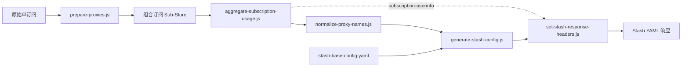

# Sub-Store → Stash Configuration Pipeline

本仓库保存一组安装 Sub-Store 后自行维护的本地脚本，用来把多个原始代理订阅整理为一份可直接交给 Stash 使用的 YAML 配置。

它不是 Sub-Store 或 Stash 的安装仓库，也不保存真实订阅地址、节点凭据或生成后的配置。仓库只维护“订阅处理 → 组合订阅处理 → Stash 文件生成与响应处理”这条流水线。

## Sub-Store、Stash 与本仓库的关系

- **Sub-Store** 负责读取不同格式的订阅、转换节点、组合多个订阅，并通过脚本扩展处理过程。
- **Stash** 是最终配置的消费者。它读取 YAML 中的节点、策略组和分流规则，并可从 HTTP 响应头读取套餐流量与到期时间。
- **本仓库** 位于两者之间：先在 Sub-Store 内整理单订阅和组合订阅，再生成符合当前使用习惯的 Stash 配置。



节点配置走实线；聚合后的流量信息通过 `subscription-userinfo` 响应头传递。

## 目录结构

```text
.
├── subscriptions/
│   └── prepare-proxies.js
├── collections/
│   ├── aggregate-subscription-usage.js
│   └── normalize-proxy-names.js
├── files/
│   ├── generate-stash-config.js
│   ├── set-stash-response-headers.js
│   └── stash-base-config.yaml
├── AGENTS.md
└── README.md
```

| 文件 | 在 Sub-Store 中的位置 | 作用 |
| --- | --- | --- |
| `subscriptions/prepare-proxies.js` | 单个订阅的脚本操作 | 添加订阅来源前缀，并统一 ECN 与测速地址 |
| `collections/aggregate-subscription-usage.js` | 组合订阅的脚本操作 | 汇总多个订阅的流量与到期信息，不修改节点 |
| `collections/normalize-proxy-names.js` | 组合订阅的脚本操作 | 删除提示节点，并生成稳定、可解析的节点名称 |
| `files/stash-base-config.yaml` | 文件的基础内容 | 提供 Stash 模式、DNS 基线和分流规则 |
| `files/generate-stash-config.js` | 文件脚本 | 读取组合订阅，注入节点并生成、校验策略组 |
| `files/set-stash-response-headers.js` | 修改响应 / Response Transformer | 设置 YAML 下载响应头并转发聚合流量信息 |

## 各阶段行为

### 1. 单订阅预处理

`prepare-proxies.js` 对每个节点执行三项处理：

1. 使用 `_subDisplayName` 或 `_subName` 给节点名添加订阅来源前缀；已经存在相同前缀时不会重复添加。
2. 设置 `ecn: true`。
3. 设置 `test-url: http://1.0.0.1/generate_204`。

来源前缀不仅用于辨识节点，也为组合订阅阶段提供后备来源信息：`normalize-proxy-names.js` 会优先读取 Sub-Store 元数据，元数据缺失时再从该前缀恢复订阅标识。

### 2. 组合订阅处理

组合订阅中的脚本顺序应为：

1. `aggregate-subscription-usage.js`
2. `normalize-proxy-names.js`

流量聚合脚本默认采用严格模式：

- 只统计有流量来源、尚未过期的订阅。
- 任一应参与统计的订阅失败时，不发布不完整的合计。
- 已用流量超过总量时按剩余流量为 0 处理，不让负余额抵扣其他套餐。
- 新版 Sub-Store 优先把结果写入当前请求的响应上下文；旧版后端才回写组合订阅记录。
- 始终原样返回节点数组，因此不会影响后续重命名。

可选参数：

| 参数 | 默认值 | 说明 |
| --- | --- | --- |
| `allow_partial=true` | `false` | 某些订阅流量读取失败时，仍发布成功部分的合计 |
| `include_expired=true` | `false` | 把已过期订阅纳入合计，并保留最早到期时间 |

节点重命名脚本输出以下格式：

```text
SUBSCRIPTION-REGION-PROTOCOL-[F|SP]-[V6]-NN
```

其中方括号字段是可选的：

- `F`：固定 IP / 静态 / 独享线路。
- `SP`：专线，例如 IEPL、IPLC、MPLS、CN2 等。
- `V6`：IPv6 节点。
- `NN`：同类节点内从 `01` 开始的序号。

示例：

```text
KTM-HK-VLESS-F-01
KTM-HK-SS-SP-01
KTM-HK-HY2-01
KTM-TW-SS-V6-01
```

这个命名格式是文件生成器的输入契约。不要只修改重命名脚本而不同步 `generate-stash-config.js` 中的解析规则。

### 3. Stash 文件生成

`generate-stash-config.js` 以 `stash-base-config.yaml` 作为 `$content`，再通过 `produceArtifact` 生成名为 `Sub-Store` 的组合订阅，目标平台固定为 `Stash`。

生成器会：

- 注入并稳定排序 `proxies`。
- 根据地区、协议、订阅来源、固定 IP、专线和 IPv6 生成分层策略组。
- 生成 `Stable`、`Home Performance`、`AI Stable`、`Default Proxy`、`Research + AI`、`Developer` 等入口。
- 把旧规则目标 `Auto` 迁移为 `Default Proxy`。
- 校验空组、重名、无效引用、自引用、循环引用、规则目标和最后一条兜底规则。
- 所有校验通过后才替换 `$content`，避免输出半成品。

当前策略有两个明确前提：

- `Stable` 至少需要一个 IPv4 VLESS/REALITY 节点或一个 IPv4 `SS-SP` 节点。
- `AI Stable` 至少需要一个位于 US、JP 或 SG 的固定 IP、VLESS/REALITY 或 `SS-SP` 节点。

不满足前提时生成器会主动报错，这是防止 Stash 把空策略组当作 `DIRECT` 的保护措施。

### 4. 响应处理

`set-stash-response-headers.js` 必须作为独立的“修改响应 / Response Transformer”使用，而不是普通文件脚本。它不会修改响应正文或状态，只负责：

- 设置 `Content-Type: text/yaml; charset=utf-8`。
- 设置下载文件名 `Stash-Sub-Store.yaml`。
- 优先从当前请求上下文转发 `subscription-userinfo`。
- 当前请求没有流量信息时，从本地组合订阅记录读取兼容性后备值。

Stash 会解析 `Subscription-Userinfo`，展示上传、下载、总流量和到期时间。

## 在 Sub-Store 中组装

1. 将三个 `operator` 脚本分别导入或粘贴为 Sub-Store 脚本操作。
2. 给需要处理的每个单订阅添加 `subscriptions/prepare-proxies.js`。
3. 创建组合订阅，名称必须为 `Sub-Store`，并选择需要聚合的订阅或标签。
4. 按顺序给组合订阅添加：
   1. `collections/aggregate-subscription-usage.js`
   2. `collections/normalize-proxy-names.js`
5. 创建一个文件，以 `files/stash-base-config.yaml` 为基础内容。
6. 将 `files/generate-stash-config.js` 配置为该文件的文件脚本。
7. 将 `files/set-stash-response-headers.js` 配置为该文件的响应转换器。
8. 先在 Sub-Store 中预览文件，确认无报错，再把文件 URL 作为远程配置导入 Stash。

不同版本的 Sub-Store 前端可能使用略有差异的字段名称，但三个挂载层级不能混用：单订阅脚本、组合订阅脚本、文件脚本与响应转换器分别承担不同职责。

## 修改时必须保持的契约

- 组合订阅名称 `Sub-Store` 同时硬编码在 `generate-stash-config.js` 和 `set-stash-response-headers.js` 中；重命名组合订阅时必须同步修改两处。
- `stash-base-config.yaml` 的最后一条规则必须保持为 `MATCH,Default Proxy`。
- 基础规则引用的策略组名称必须与生成器创建的名称一致。
- 流量聚合脚本必须位于节点重命名脚本之前。
- 响应转换器只处理响应头，不应重写已经验证完成的 YAML 正文。
- 不要把真实订阅 URL、Token、UUID、密码、节点内容或生成后的私有配置提交到仓库。

## 本地校验

这些脚本由 Sub-Store 的嵌入式运行时执行，依赖 `$substore`、`$arguments`、`$options`、`$content`、`$res`、`flowUtils`、`ProxyUtils` 和 `produceArtifact` 等全局对象，因此本地 Node.js 只能做静态语法检查。

```bash
node --check subscriptions/prepare-proxies.js
node --check collections/aggregate-subscription-usage.js
node --check collections/normalize-proxy-names.js
node --input-type=module --check < files/generate-stash-config.js
node --check files/set-stash-response-headers.js
ruby -e 'require "yaml"; path = "files/stash-base-config.yaml"; YAML.safe_load(File.read(path), aliases: true, filename: path)'
```

发布前还应完成实际运行验证：

1. 组合订阅预览中的节点名全部符合约定格式且没有重名。
2. 文件预览能生成非空的 `proxies` 和 `proxy-groups`。
3. 文件 URL 的响应包含 YAML Content-Type、下载文件名和有效的 `subscription-userinfo`。
4. Stash 能成功导入配置，策略组无空组且分流规则可用。

## 参考资料

- [Sub-Store 官方仓库](https://github.com/sub-store-org/Sub-Store)
- [Stash：快速开始](https://stash.wiki/get-started)
- [Stash：配置样例](https://stash.wiki/configuration/example-config)
- [Stash：策略组](https://stash.wiki/proxy-protocols/proxy-groups)
- [Stash：服务提供商订阅与流量响应头](https://stash.wiki/features/service-provider-subscription)
